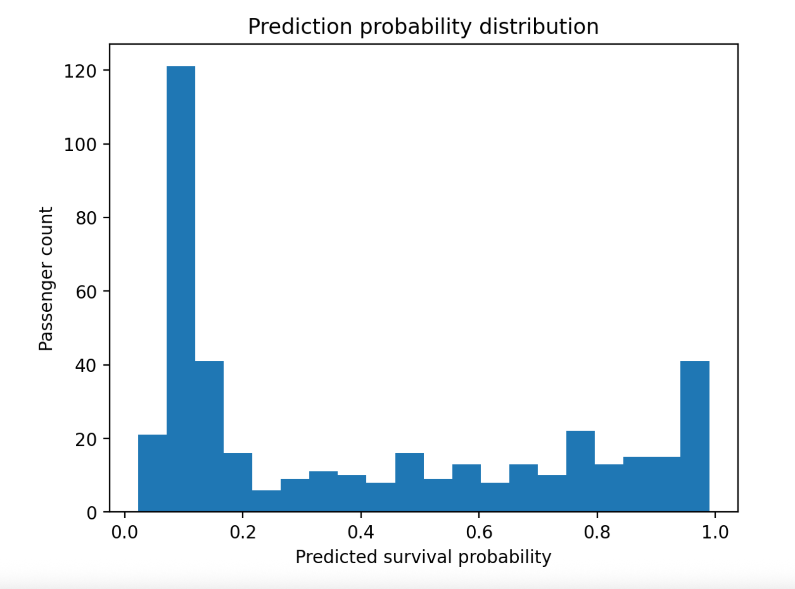

# Titanic Survival Classification with PyTorch and Streamlit

This repository contains an end to end classification pipeline for predicting Titanic passenger survival using the Kaggle Titanic dataset.

Kaggle dataset link:
https://www.kaggle.com/competitions/titanic/data

## Repository contents

| File | Purpose |
| --- | --- |
| `train.py` | Downloads the Kaggle Titanic data, preprocesses it, trains a PyTorch model, applies early stopping, and saves `model.pt`. |
| `ds_app.py` | Streamlit app for loading a Titanic-format CSV, loading the saved model, and running inference. If the uploaded CSV contains the `Survived` column, the app also reports Accuracy and ROC AUC. For Kaggle `test.csv`, which does not contain labels, the app only shows predictions and survival probabilities. |
| `eda.ipynb` | Jupyter notebook for exploratory data analysis. |
| `requirements.txt` | Python dependencies. |
| `README.md` | Setup and run instructions. |

No dataset files are committed. The dataset is fetched directly from Kaggle by the code.

## Setup

Clone the repository:

```bash
git clone https://github.com/Shanibudi/Titanic-classification-project.git
cd Titanic-classification-project
```

Create and activate a virtual environment:

For macOS/Linux:
```bash
python3 -m venv .venv
source .venv/bin/activate
```
For Windows:
```bash
python -m venv .venv
.venv\Scripts\activate
```

Install the required packages:
```bash
python -m pip install -r requirements.txt
```

## Kaggle data access

The code downloads the Titanic competition data directly from Kaggle using `kagglehub`.

Before running the project, open the Titanic competition page:

https://www.kaggle.com/competitions/titanic/data

Create a Legacy API Key once and place the downloaded `kaggle.json` file in the Kaggle configuration directory.

Linux or macOS:

```bash
mkdir -p ~/.kaggle
mv kaggle.json ~/.kaggle/kaggle.json
chmod 600 ~/.kaggle/kaggle.json
```

Windows:

```powershell
mkdir $env:USERPROFILE\.kaggle
move kaggle.json $env:USERPROFILE\.kaggle\kaggle.json
```

## Run EDA

Start Jupyter and open the notebook:

```bash
jupyter notebook eda.ipynb
```

The notebook downloads the Kaggle data if it is missing, loads `train.csv`, and performs exploratory data analysis on the training set. It includes survival distribution, missing value analysis, categorical feature analysis, numeric feature analysis, and exploration of additional feature ideas.

## Train the model

Train the model:

```bash
python train.py
```

The training script performs the following steps:

1. Downloads Titanic files from Kaggle into `data/` using `kagglehub` if they are missing.
2. Loads Kaggle `train.csv`.
3. Creates new features such as title, family size, alone indicator, cabin known indicator, and ticket group size.
4. Splits the Kaggle train set into 80% train and 20% validation.
5. Fits preprocessing only on the training split.
6. Trains a PyTorch MLP classifier.
7. Applies early stopping based on validation loss.
8. Saves the checkpoint to `model.pt`.

The checkpoint includes the model weights, preprocessing pipeline, feature lists, threshold, hyperparameters, and validation metrics.

## Run the Streamlit app

Run the app:

```bash
python -m streamlit run ds_app.py
```

In the app:

1. Enter the model path, usually `model.pt`.
2. Enter the CSV path, for example `data/test.csv`.
3. Click `Run inference`.

```markdown

```

If the CSV does not contain `Survived`, the app shows predictions and probability plots only.

If the CSV contains a `Survived` column, the app also reports two evaluation metrics:

| Metric | Meaning |
| --- | --- |
| Accuracy | Percentage of correct survival predictions using saved threshold (default 0.5). |
| ROC AUC | Ranking quality of survival probabilities across classes. |

## Model architecture

The model is a small multilayer perceptron (MLP) designed for tabular binary classification. It uses one hidden layer with ReLU activation and dropout. This allows the network to learn nonlinear interactions between the Titanic features while keeping the architecture simple enough for the small dataset.

Input features after preprocessing pass through:

```text
Linear -> ReLU -> Dropout -> Linear
```

The final layer outputs one logit. Training uses BCEWithLogitsLoss, and inference applies sigmoid to produce survival probabilities.

## Preprocessing design

Numeric columns:

```text
Pclass, Age, SibSp, Parch, Fare, LogFare, FamilySize, IsAlone, CabinKnown, TicketGroupSize
```

Categorical columns:
```text
Sex, Embarked, Title
```

Preprocessing choices:

1. Missing numeric values are imputed using the median because it is robust to outliers.
2. Numeric features are standardized using StandardScaler.
3. Missing categorical values are imputed using the most frequent category.
4. Categorical features are converted to numeric features using one hot encoding.
5. handle_unknown="ignore" is used for robust inference on unseen categories.
6. The Cabin column is not used directly due to many missing values; instead, a CabinKnown indicator is created.

## Validation and model selection
The original Kaggle test.csv does not include the Survived labels, so it cannot be used for local supervised evaluation. Therefore, `train.py` creates a held-out validation set from Kaggle `train.csv` using an 80% and 20% stratified split.

The validation set is used to evaluate how well the model generalizes to unseen data, monitor overfitting, select the best training epoch using early stopping based on validation loss, and compare training hyperparameters. The saved checkpoint corresponds to the model with the best validation loss.

Two evaluation metrics are reported:
```text
Accuracy
ROC AUC
```
Accuracy measures the percentage of correct survival predictions. ROC AUC measures how well the model ranks survival probabilities across the two classes.

## Notes

The `data/` folder is generated at runtime.

The trained checkpoint `model.pt` is included in the repository to allow quick testing of the Streamlit app without retraining.

## Results

```markdown

```
